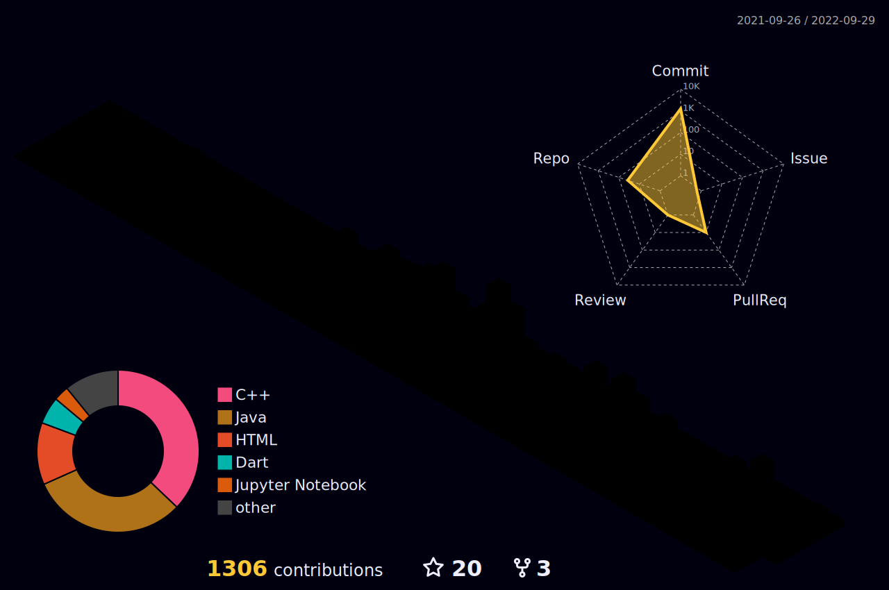

 <h1>🖖</h1>
 <h1 align="center">Hi, I'm <b>Shahzaneer Ahmed</b></h1>
  
  

 ## 🙋‍♂️ About Me

- 🎓 I'm **CS** _Sophomore_ at <a href="https://comsats.edu.pk/" >COMSATS Institute of Information Technology Islamabad.</a>
- 👯 I'm Publication Manager at <a href="https://www.linkedin.com/company/35938057/" >Flutter Islamabad </a>
- 🌱 I'm currently learning <b>Flutter,Firebase,Node.js, and Data Science</b>
- 🗣️ I’m looking to collaborate with **Open-Source Projects.**
- 📫 Reach out to me @**shahzaneer.dev@gmail.com**.
- ⚡ Goal for 2022-23 - To Become a *Fullstack Developer* and *Junior Data Scientist.*
- 😎 **Fun fact:** I love **Journalism** and like to play **Cricket**.

<!--Social Media Links!-->

## Connect with me:

     

#

## 🚀 Technologies and Tools

 
   &emsp;
 &emsp;
 &emsp;
 &emsp;
 &emsp;
  &emsp;

 
  
 &emsp;
  &emsp; 
   &emsp;
  &emsp;
  &emsp;
  &emsp;

---

## 📈 Contribution Graph

<h2><i>⚙️ GitHub Analytics</i></h2>

  

## ⚡️Github Contributions
	
<h4 align="center">Isometric view of contributions in the last year</h4>

	

## 🚀Github Metrics

	

 

## 🐛Github Magic Game

  

 

## ❤ Views and Followers

  
